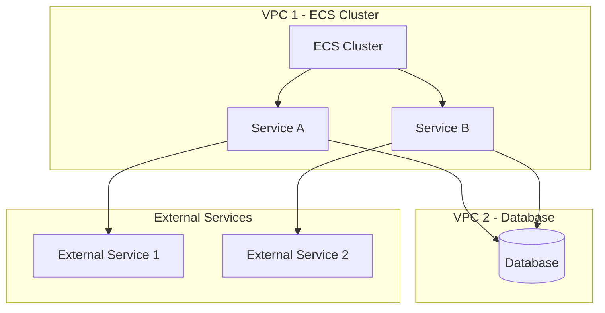

# this is testing

```mermaid

graph TD
    subgraph VPC1[VPC 1 - ECS Cluster]
        ECS[ECS Cluster]
        ServiceA[Service A]
        ServiceB[Service B]
        ECS --> ServiceA
        ECS --> ServiceB
    end

    subgraph VPC2[VPC 2 - Database]
        DB[(Database)]
    end

    subgraph ExternalServices[External Services]
        ExternalService1[External Service 1]
        ExternalService2[External Service 2]
    end

    ServiceA --> DB
    ServiceB --> DB
    ServiceA --> ExternalService1
    ServiceB --> ExternalService2

```
